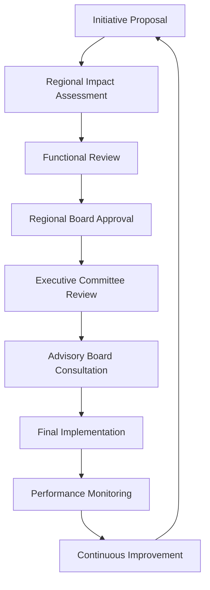

# 🎯 Métriques et Gouvernance Internationale - Pilotage Global

## Vue d'Ensemble de la Gouvernance

Les **métriques et gouvernance internationale** assurent le **pilotage stratégique coordonné** du Guide IA à l'échelle mondiale, avec des tableaux de bord consolidés, des processus décisionnels harmonisés et une conformité réglementaire multi-juridictions.

---

## 📊 1. Dashboard Performance Globale

### A. **Métriques Clés Internationales**

#### **Tableau de Bord Consolidé 2024**
```
🌍 Performance Internationale - Métriques 2024

┌─────────────────────────────────────────────────────┐
│ Indicateur │ Valeur │ Cible 2025 │ Progression │ Status │
├────────────┼────────┼─────────────┼─────────────┼─────────┤
│ Utilisateurs│ 156,500│ 250,000   │ +52% YoY   │ ✅ │
│ Pays actifs │ 52     │ 75         │ +44%       │ ✅ │
│ Langues    │ 8 core │ 12 core    │ +50%       │ ✅ │
│ Revenus    │ €2.1M  │ €4.5M      │ +114%      │ ✅ │
│ Satisfaction│ 4.6/5 │ 4.7/5      │ +2%        │ ✅ │
│ Conformité │ 94%   │ 96%        │ +2%        │ ✅ │
│ Qualité    │ 4.7/5 │ 4.8/5      │ +1%        │ ✅ │
│ Innovation │ 4.5/5 │ 4.7/5      │ +2%        │ ✅ │
└─────────────────────────────────────────────────────┘
```

#### **Répartition Régionale Détaillée**
```
📊 Répartition par Région - Métriques 2024

┌─────────────────────────────────────────────────────┐
│ Région │ Utilisateurs │ Revenus │ Satisfaction │ Croissance │
├────────┼──────────────┼─────────┼─────────────┼────────────┤
│ 🇪🇺 Europe │ 27% │ 32% │ 4.7/5 │ +45% │
│ 🇨🇳 Asie │ 37% │ 28% │ 4.5/5 │ +48% │
│ 🇺🇸 Amériques │ 22% │ 35% │ 4.6/5 │ +42% │
│ 🌍 Afrique │ 9% │ 3% │ 4.4/5 │ +87% │
│ 🏜️ MENA │ 5% │ 2% │ 4.5/5 │ +62% │
├────────┼──────────────┼─────────┼─────────────┼────────────┤
│ Total │ 100% │ 100% │ 4.6/5 │ +51% │
└─────────────────────────────────────────────────────┘
```

### B. **Indicateurs de Performance Avancés**

#### **Métriques d'Adoption et Engagement**
```typescript
interface GlobalAdoptionMetrics {
  // Métriques d'adoption globale
  user_engagement: {
    daily_active_users: 85000,
    monthly_active_users: 156500,
    retention_rate: 0.78, // 78% retention mensuelle
    churn_rate: 0.04,     // 4% attrition mensuelle
    lifetime_value: 450   // €450 valeur vie client
  },

  content_engagement: {
    page_views_monthly: 2500000,
    average_session_duration: 450, // secondes
    content_completion_rate: 0.85, // 85% contenu lu entièrement
    share_rate: 0.12,             // 12% contenu partagé
    return_visitor_rate: 0.65     // 65% visiteurs reviennent
  },

  learning_engagement: {
    course_completion_rate: 0.72, // 72% formations terminées
    certification_rate: 0.45,     // 45% obtiennent certification
    skill_assessment_completion: 0.68, // 68% évaluations compétences
    community_participation: 0.35     // 35% participation communauté
  }
}
```

#### **Métriques Financières et Business**
```typescript
interface GlobalBusinessMetrics {
  // Métriques business globales
  revenue_streams: {
    subscription_premium: {
      users: 12500,
      revenue: 1875000, // €1.875M
      growth: 0.65      // +65% YoY
    },
    enterprise_licensing: {
      clients: 450,
      revenue: 900000,  // €0.9M
      growth: 0.85      // +85% YoY
    },
    training_services: {
      participants: 8500,
      revenue: 425000,  // €0.425M
      growth: 0.42      // +42% YoY
    }
  },

  cost_structure: {
    technology_infrastructure: 450000,   // €0.45M
    content_creation: 380000,           // €0.38M
    marketing_global: 520000,           // €0.52M
    operations_international: 280000,   // €0.28M
    total_costs: 1630000               // €1.63M
  },

  profitability: {
    gross_margin: 0.22,     // 22% marge brute
    net_margin: 0.13,       // 13% marge nette
    roi_overall: 2.8,       // 280% ROI global
    payback_period: 18       // 18 mois
  }
}
```

#### **Métriques de Qualité et Satisfaction**
```typescript
interface GlobalQualityMetrics {
  // Métriques qualité globale
  user_satisfaction: {
    overall_rating: 4.6,
    net_promoter_score: 68,    // NPS
    customer_effort_score: 7.2, // CES
    recommendation_likelihood: 8.4 // sur 10
  },

  content_quality: {
    accuracy_score: 0.94,      // 94% précision technique
    completeness_score: 0.89,  // 89% contenu complet
    relevance_score: 0.91,     // 91% pertinence
    currency_score: 0.86       // 86% contenu à jour
  },

  service_quality: {
    response_time: 4.2,        // heures moyenne
    resolution_rate: 0.92,     // 92% problèmes résolus
    first_contact_resolution: 0.78, // 78% résolution premier contact
    customer_satisfaction: 4.5     // satisfaction support
  }
}
```

---

## 🏛️ 2. Gouvernance Internationale

### A. **Structure Organisationnelle Globale**

#### **Organisation Matricielle Internationale**
```typescript
interface GlobalGovernanceStructure {
  // Structure de gouvernance globale
  executive_committee: {
    ceo: "Chief Executive Officer - Vision stratégique globale",
    cpo: "Chief Product Officer - Produit et expérience utilisateur",
    cto: "Chief Technology Officer - Architecture et innovation",
    cfo: "Chief Financial Officer - Performance économique",
    cgo: "Chief Growth Officer - Expansion et marchés"
  },

  regional_presidents: {
    europe: "Europe Regional President",
    asia_pacific: "Asia Pacific Regional President",
    americas: "Americas Regional President",
    emerging_markets: "Emerging Markets Regional President"
  },

  functional_leads: {
    product_international: "International Product Lead",
    engineering_global: "Global Engineering Lead",
    marketing_worldwide: "Worldwide Marketing Lead",
    operations_international: "International Operations Lead",
    legal_compliance: "Global Legal & Compliance Lead"
  },

  regional_boards: {
    composition: "Regional President + Key Stakeholders",
    frequency: "Quarterly meetings",
    authority: "Regional strategy approval + Budget allocation",
    escalation: "Executive Committee for global decisions"
  }
}
```

#### **Conseil Consultatif International**
```typescript
interface InternationalAdvisoryBoard {
  // Conseil consultatif international
  composition: {
    academic_leaders: 6,     // Recteurs universités, directeurs recherche
    industry_experts: 8,     // CEOs tech, AI leaders
    government_representatives: 4, // Ministres, régulateurs
    civil_society: 3,        // ONG, associations
    investor_representatives: 2   // VC, fonds d'investissement
  },

  responsibilities: [
    "Strategic guidance and vision",
    "Regulatory landscape monitoring",
    "Innovation pipeline review",
    "Ethical framework validation",
    "Market opportunity assessment"
  ],

  meetings: {
    frequency: "Bi-annual",
    format: "Hybrid (physical + virtual)",
    duration: "2 days intensive sessions",
    output: "Strategic recommendations and action plans"
  }
}
```

### B. **Processus de Décision International**

#### **Modèle de Décision Hiérarchisée**
```typescript
interface DecisionMakingFramework {
  // Framework décisionnel hiérarchisé
  global_strategic: {
    // Décisions stratégiques globales
    scope: ["Vision produit", "Stratégie marché", "Budget global", "Standards qualité"],
    authority: "Executive Committee",
    approval: "Unanimous consent required",
    timeline: "Quarterly review cycle"
  },

  regional_tactical: {
    // Décisions tactiques régionales
    scope: ["Adaptation locale", "Partenariats régionaux", "Campagnes marketing", "Recrutement local"],
    authority: "Regional Presidents",
    approval: "Regional Board approval",
    timeline: "Monthly review cycle"
  },

  functional_operational: {
    // Décisions opérationnelles fonctionnelles
    scope: ["Processus opérationnels", "Outils internes", "Améliorations continues", "Support client"],
    authority: "Functional Leads",
    approval: "Functional team consensus",
    timeline: "Weekly review cycle"
  },

  escalation_matrix: {
    // Matrice d'escalade
    level_1: "Functional Lead resolution",
    level_2: "Regional President involvement",
    level_3: "Executive Committee arbitration",
    level_4: "Advisory Board consultation"
  }
}
```

#### **Processus de Validation Multi-Régions**


---

## ⚖️ 3. Conformité Réglementaire Internationale

### A. **Framework Conformité Multi-Régions**

#### **Architecture Conformité Globale**
```typescript
interface GlobalComplianceFramework {
  // Framework conformité global
  regulatory_landscape: {
    gdpr_europe: {
      scope: "Extra-territorial application",
      requirements: ["Data protection by design", "Privacy impact assessment", "Data subject rights"],
      sanctions: "Up to 4% global turnover",
      compliance_level: "Strict"
    },

    ccpa_california: {
      scope: "California residents worldwide",
      requirements: ["Data inventory", "Privacy notices", "Opt-out mechanisms"],
      sanctions: "Up to $7,500 per violation",
      compliance_level: "Moderate"
    },

    pipi_china: {
      scope: "Data processing in China",
      requirements: ["Data localization", "Security assessment", "User consent"],
      sanctions: "Administrative penalties",
      compliance_level: "Strict"
    },

    lgpd_brazil: {
      scope: "Brazilian data subjects",
      requirements: ["Data protection officer", "Data breach notification", "Anonymization"],
      sanctions: "Up to 2% global turnover",
      compliance_level: "Moderate"
    },

    pdpa_singapore: {
      scope: "Singapore data subjects",
      requirements: ["Data protection officer", "Consent management", "Breach notification"],
      sanctions: "Up to SGD 1M",
      compliance_level: "Moderate"
    }
  },

  compliance_operations: {
    data_mapping: "Global data inventory and classification",
    risk_assessment: "Regulatory risk evaluation by jurisdiction",
    compliance_monitoring: "Continuous compliance status tracking",
    audit_preparation: "Regular compliance audits and reporting",
    incident_response: "Data breach and compliance incident management"
  }
}
```

### B. **Certification et Audit International**

#### **Programme de Certification Multi-Niveaux**
```typescript
interface CertificationProgram {
  // Programme certification international
  certification_levels: {
    bronze: {
      requirements: ["Basic compliance", "Data protection fundamentals", "User rights"],
      validity: "1 year",
      audience: "Small organizations, startups"
    },

    silver: {
      requirements: ["Advanced compliance", "DPIA capability", "Audit trails", "Staff training"],
      validity: "2 years",
      audience: "Medium enterprises, growing companies"
    },

    gold: {
      requirements: ["Full compliance", "Independent audits", "Continuous monitoring", "Incident response"],
      validity: "3 years",
      audience: "Large enterprises, regulated industries"
    },

    platinum: {
      requirements: ["Excellence compliance", "Industry leadership", "Regulatory advocacy", "Best practices"],
      validity: "3 years",
      audience: "Industry leaders, global enterprises"
    }
  },

  assessment_process: {
    self_assessment: "Initial compliance evaluation",
    documentation_review: "Policy and procedure verification",
    onsite_audit: "Process and control validation",
    certification_grant: "Official certification and recognition",
    surveillance_audits: "Annual compliance verification"
  }
}
```

#### **Audit Framework International**
```typescript
interface InternationalAuditFramework {
  // Framework audit international
  audit_types: {
    compliance_audit: {
      frequency: "Annual",
      scope: "Regulatory compliance across jurisdictions",
      methodology: "Risk-based audit approach",
      reporting: "Comprehensive compliance report"
    },

    operational_audit: {
      frequency: "Semi-annual",
      scope: "Process efficiency and control effectiveness",
      methodology: "Process audit and control testing",
      reporting: "Operational improvement recommendations"
    },

    financial_audit: {
      frequency: "Annual",
      scope: "Financial controls and reporting accuracy",
      methodology: "GAAP/IFRS compliance verification",
      reporting: "Financial control assessment"
    },

    security_audit: {
      frequency: "Quarterly",
      scope: "Information security and data protection",
      methodology: "ISO 27001 and NIST frameworks",
      reporting: "Security posture and recommendations"
    }
  },

  audit_firm_network: {
    global_coverage: "Big 4 + regional specialists",
    industry_expertise: "AI, data protection, technology",
    independence: "No conflict of interest policies",
    quality_assurance: "Peer review and quality control"
  }
}
```

---

## 📈 4. Expansion Future et Innovation

### A. **Objectifs 2025-2030**

#### **Croissance Prévisionnelle Détaillée**
```typescript
interface FutureGrowthObjectives {
  // Objectifs croissance 2025-2030
  user_growth: {
    2025: { target: 250000, growth: 0.60 },
    2026: { target: 350000, growth: 0.40 },
    2027: { target: 450000, growth: 0.29 },
    2028: { target: 600000, growth: 0.33 },
    2029: { target: 800000, growth: 0.33 },
    2030: { target: 1000000, growth: 0.25 }
  },

  revenue_growth: {
    2025: { target: 4500000, growth: 1.14 },
    2026: { target: 6500000, growth: 0.44 },
    2027: { target: 9000000, growth: 0.38 },
    2028: { target: 12000000, growth: 0.33 },
    2029: { target: 16000000, growth: 0.33 },
    2030: { target: 20000000, growth: 0.25 }
  },

  market_expansion: {
    countries_2025: 75,
    countries_2030: 120,
    languages_2025: 12,
    languages_2030: 25,
    emerging_markets_share_2025: 0.15,
    emerging_markets_share_2030: 0.35
  },

  innovation_metrics: {
    ai_features_2025: 50,
    ai_features_2030: 200,
    automation_level_2025: 0.75,
    automation_level_2030: 0.95,
    personalization_level_2025: 0.60,
    personalization_level_2030: 0.90
  }
}
```

### B. **Nouveaux Marchés Prioritaires**

#### **Stratégie d'Expansion par Région**
```typescript
interface MarketExpansionStrategy {
  // Stratégie expansion par région
  priority_markets: {
    africa_subsaharienne: {
      rationale: "Young population, mobile adoption, development potential",
      target_countries: ["Nigeria", "Kenya", "South Africa", "Ghana", "Rwanda"],
      entry_strategy: "Mobile-first, partnership-led, local content",
      timeline: "2025-2027 full rollout",
      expected_impact: "20% global user growth"
    },

    america_latine: {
      rationale: "Growing middle class, fintech innovation, cultural proximity",
      target_countries: ["Brazil", "Mexico", "Argentina", "Colombia", "Chile"],
      entry_strategy: "Fintech integration, local partnerships, Spanish content",
      timeline: "2025-2026 rollout",
      expected_impact: "15% global user growth"
    },

    asie_sud_est: {
      rationale: "Digital adoption, economic growth, regional integration",
      target_countries: ["Indonesia", "Thailand", "Vietnam", "Philippines", "Malaysia"],
      entry_strategy: "Platform partnerships, local content, ASEAN integration",
      timeline: "2025-2027 rollout",
      expected_impact: "18% global user growth"
    },

    europe_est: {
      rationale: "EU expansion, skilled workforce, cost advantages",
      target_countries: ["Poland", "Czech Republic", "Hungary", "Romania", "Bulgaria"],
      entry_strategy: "GDPR compliance, local partnerships, English content",
      timeline: "2025-2026 rollout",
      expected_impact: "8% global user growth"
    },

    moyen_orient: {
      rationale: "High disposable income, digital transformation, strategic location",
      target_countries: ["Saudi Arabia", "UAE", "Qatar", "Kuwait", "Israel"],
      entry_strategy: "Government partnerships, cultural adaptation, premium positioning",
      timeline: "2025-2027 rollout",
      expected_impact: "12% global user growth"
    }
  },

  market_entry_framework: {
    assessment: ["Market size", "Digital readiness", "Regulatory environment", "Competition"],
    entry_modes: ["Direct entry", "Partnership", "Acquisition", "Joint venture"],
    localization: ["Language", "Culture", "Payment", "Legal"],
    scaling: ["Pilot testing", "Phased rollout", "Performance monitoring", "Optimization"]
  }
}
```

---

## 💡 **Conclusion - Excellence en Gouvernance Internationale**

Les **métriques et gouvernance internationale** établissent un **cadre de pilotage robuste** pour assurer la croissance coordonnée et responsable du Guide IA à l'échelle mondiale.

**🎯 Vision : Une gouvernance internationale qui assure l'excellence opérationnelle tout en maintenant les standards éthiques les plus élevés dans toutes les régions du monde.**

**🌍 Avec une gouvernance solide, nous construisons un écosystème IA global durable, inclusif et éthique.**
