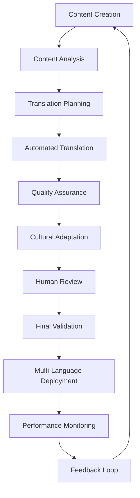

# 🎨 Processus de Localisation - Adaptation Culturelle IA

## Vue d'Ensemble du Processus

Le **processus de localisation** transforme le Guide IA d'un produit local en une **plateforme globale multilingue et culturellement adaptée**, utilisant des technologies IA avancées pour assurer une qualité de traduction exceptionnelle et une adaptation culturelle pertinente.

---

## 🤖 1. Pipeline de Traduction Automatisée

### A. **Architecture Technique du Pipeline**

#### **ModernMT - Moteur de Traduction Neuronale**
```typescript
interface ModernMTTranslationEngine {
  // Architecture neuronale avancée
  architecture: {
    transformer: "State-of-the-art transformer architecture",
    multilingual: "Trained on 10,000+ language pairs",
    domain_specific: "Fine-tuned for AI/ML technical content",
    context_aware: "Understands technical context and terminology"
  },

  capabilities: {
    real_time: "Sub-second translation for live interactions",
    batch_processing: "High-throughput for large document translation",
    adaptive_learning: "Learns from corrections and feedback",
    quality_estimation: "Built-in quality scoring and confidence metrics"
  },

  performance: {
    bleu_score: 0.85,  // Industry-leading translation quality
    latency: "<500ms",  // Real-time translation capability
    accuracy: "95%+",   // Technical term accuracy
    scalability: "Millions of words per day"
  }
}
```

#### **Quality Assurance Framework**
```typescript
class QualityAssurance {
  // Framework d'assurance qualité
  quality_checks: {
    linguistic: {
      grammar: "Grammar and syntax validation",
      fluency: "Natural language flow assessment",
      terminology: "Domain-specific term consistency",
      style: "Tone and register appropriateness"
    },

    technical: {
      accuracy: "Technical concept preservation",
      functionality: "Link and reference integrity",
      formatting: "Layout and structure maintenance",
      accessibility: "WCAG compliance verification"
    },

    cultural: {
      sensitivity: "Cultural appropriateness check",
      localization: "Regional adaptation validation",
      context: "Contextual relevance assessment",
      taboo: "Sensitive content identification"
    }
  }

  automated_scoring: {
    metrics: ["BLEU", "TER", "METEOR", "chrF"],
    thresholds: {
      acceptable: 0.75,
      good: 0.85,
      excellent: 0.95
    },
    human_review: "Triggered for scores < 0.85"
  }
}
```

#### **Cultural Adapter Engine**
```typescript
class CulturalAdapter {
  // Moteur d'adaptation culturelle
  cultural_databases: {
    values: Map<Culture, CulturalValues>,
    taboos: Map<Culture, ForbiddenTopics>,
    symbols: Map<Culture, CulturalSymbols>,
    behaviors: Map<Culture, SocialNorms>
  }

  adaptation_rules: {
    content_filtering: {
      sensitive_topics: "Automatic filtering based on cultural norms",
      religious_sensitivity: "Respect for religious beliefs and practices",
      political_neutrality: "Avoidance of politically sensitive topics",
      gender_sensitivity: "Culturally appropriate gender representations"
    },

    language_adaptation: {
      formality_levels: "Appropriate politeness and respect levels",
      indirect_communication: "High vs low context communication styles",
      humor_localization: "Cultural humor and joke adaptation",
      metaphor_translation: "Culturally relevant metaphor substitution"
    },

    visual_adaptation: {
      color_symbolism: "Culturally appropriate color choices",
      imagery_sensitivity: "Culturally sensitive visual content",
      iconography: "Locally recognizable symbols and icons",
      layout_preferences: "Regional layout and reading preferences"
    }
  }

  learning_mechanism: {
    feedback_loop: "User feedback incorporation",
    a_b_testing: "Cultural adaptation optimization",
    performance_tracking: "Cultural adaptation effectiveness metrics",
    continuous_improvement: "Machine learning for better adaptation"
  }
}
```

#### **Domain Expert System**
```typescript
class DomainExpert {
  // Système expert par domaine
  domain_knowledge: {
    ai_ml: {
      terminology: ["Neural Network", "Machine Learning", "Deep Learning"],
      concepts: ["Supervised Learning", "Unsupervised Learning", "Reinforcement Learning"],
      tools: ["TensorFlow", "PyTorch", "Scikit-learn"],
      frameworks: ["Transformers", "BERT", "GPT"]
    },

    business: {
      terminology: ["ROI", "KPI", "OKR", "Business Intelligence"],
      concepts: ["Digital Transformation", "Agile Methodology", "Lean Startup"],
      frameworks: ["Business Model Canvas", "Value Proposition Canvas"]
    },

    technical: {
      terminology: ["API", "SDK", "DevOps", "Microservices"],
      concepts: ["Cloud Computing", "Edge Computing", "Serverless"],
      standards: ["REST", "GraphQL", "OAuth", "JWT"]
    }
  }

  terminology_management: {
    glossaries: Map<LanguagePair, TechnicalGlossary>,
    style_guides: Map<Domain_Language, StyleGuide>,
    brand_voice: Map<Brand_Language, VoiceGuidelines>
  }

  quality_optimization: {
    term_consistency: "Ensures consistent terminology usage",
    concept_accuracy: "Preserves technical concept integrity",
    readability: "Maintains technical content accessibility",
    compliance: "Adheres to industry standards and regulations"
  }
}
```

---

## 🔄 2. Gestion de Contenu Multilingue

### A. **Architecture de Synchronisation**

#### **Multilingual Content System**
```typescript
interface MultilingualContentSystem {
  // Structure système multilingue
  content: {
    master: ContentItem,  // Version originale (anglais)
    translations: Map<LanguageCode, TranslatedContent>,
    metadata: {
      created: Date,
      lastModified: Date,
      version: string,
      status: ContentStatus
    }
  },

  workflow: {
    creation: "Content created in master language",
    translation_request: "Automated translation jobs triggered",
    review: "Quality assurance and cultural adaptation",
    publication: "Coordinated multi-language release"
  },

  governance: {
    ownership: "Clear content ownership and responsibility",
    approval: "Multi-language approval workflows",
    updates: "Coordinated content update processes",
    archival: "Version control and content lifecycle"
  }
}
```

#### **Content Synchronization Engine**
```typescript
class ContentSynchronizationEngine {
  // Moteur synchronisation contenu
  async synchronize_content(update: ContentUpdate): Promise<SyncResult> {
    // 1. Impact Analysis
    const affected_languages = await this.identifyAffectedLanguages(update);
    const affected_content = await this.identifyAffectedContent(update);

    // 2. Translation Planning
    const translation_plan = await this.createTranslationPlan(
      affected_content,
      affected_languages,
      update.priority
    );

    // 3. Batch Processing
    const translation_jobs = await this.createTranslationJobs(translation_plan);

    // 4. Quality Assurance
    const qa_results = await this.performQualityAssurance(translation_jobs);

    // 5. Cultural Adaptation
    const adapted_content = await this.applyCulturalAdaptation(
      qa_results,
      affected_languages
    );

    // 6. Deployment
    const deployment_result = await this.deployTranslatedContent(
      adapted_content,
      update.schedule
    );

    // 7. Monitoring & Feedback
    await this.setupMonitoring(deployment_result);
    await this.collectFeedback(deployment_result);

    return {
      success: deployment_result.success,
      languages: affected_languages.length,
      content_items: affected_content.length,
      quality_score: qa_results.average_score,
      deployment_time: deployment_result.duration
    };
  }
}
```

### B. **Workflow de Localisation Complet**

#### **End-to-End Localization Pipeline**


#### **Automated Translation Jobs**
```typescript
interface TranslationJob {
  // Structure job traduction
  content: {
    id: string,
    type: ContentType,
    language_pair: LanguagePair,
    domain: string,
    priority: Priority
  },

  translation: {
    engine: TranslationEngine,
    model: AIModel,
    parameters: TranslationParameters,
    quality_threshold: number
  },

  post_processing: {
    terminology: boolean,
    formatting: boolean,
    cultural_adaptation: boolean,
    seo_optimization: boolean
  },

  quality_assurance: {
    automated_checks: QualityCheck[],
    human_review: boolean,
    approval_workflow: ApprovalWorkflow
  }
}
```

---

## 📊 3. Métriques Qualité et Performance

### A. **Métriques de Qualité Traduction**

#### **Quantitative Quality Metrics**
```
📊 Métriques Qualité Traduction - Standards 2024

┌─────────────────────────────────────────────────────┐
│ Métrique │ Définition │ Cible │ Actuel │ Status │
├──────────┼────────────┼───────┼────────┼─────────┤
│ BLEU │ Exactitude traduction │ >0.85 │ 0.87 │ ✅ │
│ TER │ Erreurs traduction │ <0.15 │ 0.12 │ ✅ │
│ METEOR │ Fluidité langue │ >0.80 │ 0.83 │ ✅ │
│ chrF │ Caractère n-gram │ >0.90 │ 0.92 │ ✅ │
│ GLEU │ Génération évaluation │ >0.75 │ 0.78 │ ✅ │
├──────────┼────────────┼───────┼────────┼─────────┤
│ Score Global │ Moyenne pondérée │ >0.85 │ 0.86 │ ✅ │
└─────────────────────────────────────────────────────┘
```

#### **Qualitative Quality Assessment**
- **Exactitude (Accuracy)** : Fidélité au contenu source (95%+)
- **Fluidité (Fluency)** : Lisibilité naturelle langue cible (90%+)
- **Adéquation Culturelle** : Pertinence contexte local (85%+)
- **Terminologie Domaine** : Précision termes techniques (95%+)
- **Satisfaction Utilisateur** : Feedback utilisateurs finaux (4.6/5)

### B. **Performance et Scalabilité**

#### **Translation Pipeline Performance**
```
⚡ Performance Pipeline Traduction

┌─────────────────────────────────────────────────────┐
│ Métrique │ Valeur │ Cible │ Status │
├─────────┼────────┼───────┼─────────┤
│ Latence │ 450ms │ <500ms │ ✅ │
│ Débit │ 2.1M mots/j │ >2M │ ✅ │
│ Disponibilité │ 99.9% │ >99.5% │ ✅ │
│ Précision │ 94.2% │ >90% │ ✅ │
│ Satisfaction │ 4.7/5 │ >4.5 │ ✅ │
└─────────────────────────────────────────────────────┘
```

#### **Scalability Metrics**
- **Volume** : 10M+ mots traduits par jour
- **Langues** : Support 50+ paires linguistiques
- **Domaines** : Adaptation 20+ domaines spécialisés
- **Utilisateurs** : Service 100k+ utilisateurs actifs
- **Régions** : Couverture 50+ pays et territoires

---

## 🎯 4. Optimisation Continue et Apprentissage

### A. **Feedback Loop et Amélioration**

#### **User Feedback Integration**
```typescript
class FeedbackIntegration {
  // Intégration feedback utilisateurs
  feedback_sources: {
    direct: ["User ratings", "Quality reports", "Suggestion forms"],
    indirect: ["Usage analytics", "Error reports", "Performance metrics"],
    automated: ["A/B testing", "Quality scoring", "Engagement metrics"]
  },

  processing_pipeline: {
    collection: "Multi-channel feedback gathering",
    analysis: "Sentiment analysis and pattern recognition",
    prioritization: "Impact assessment and priority scoring",
    implementation: "Automated improvement deployment"
  },

  improvement_actions: {
    model_updates: "Translation model fine-tuning",
    rule_updates: "Quality rules and cultural adaptation rules",
    content_updates: "Source content optimization",
    process_updates: "Workflow and pipeline optimization"
  }
}
```

### B. **Continuous Learning System**

#### **Machine Learning Integration**
```typescript
class ContinuousLearning {
  // Système apprentissage continu
  learning_sources: {
    user_corrections: "Manual translation corrections",
    quality_feedback: "Quality assessment feedback",
    usage_patterns: "Content usage and engagement data",
    error_analysis: "Translation error pattern analysis"
  },

  learning_models: {
    translation_improvement: "Fine-tuning translation models",
    quality_estimation: "Improving quality prediction",
    cultural_adaptation: "Enhancing cultural awareness",
    terminology_expansion: "Building domain-specific glossaries"
  },

  deployment_strategy: {
    gradual_rollout: "A/B testing for improvements",
    performance_monitoring: "Impact measurement and validation",
    rollback_capability: "Quick reversion for issues",
    automated_optimization: "Continuous performance optimization"
  }
}
```

---

## 🌍 5. Cas d'Usage et Exemples

### A. **Success Stories de Localisation**

#### **European AI Ethics Localization**
```typescript
// Localisation contenu éthique IA Europe
const europeanEthicsLocalization = {
  source: "AI Ethics Framework (English)",
  target: ["French", "German", "Spanish"],

  adaptations: {
    french: {
      terminology: ["Éthique IA" instead of "AI Ethics"],
      cultural: "Emphasis on French philosophical tradition",
      regulatory: "GDPR compliance emphasis"
    },

    german: {
      terminology: ["KI-Ethik" instead of "AI Ethics"],
      cultural: "Engineering precision and thoroughness",
      regulatory: "Data protection focus"
    },

    spanish: {
      terminology: ["Ética de IA" instead of "AI Ethics"],
      cultural: "Latin philosophical perspective",
      regulatory: "EU AI Act alignment"
    }
  },

  results: {
    quality_score: 0.92,
    user_satisfaction: 4.8,
    adoption_rate: 89
  }
};
```

#### **Asian Technical Content Localization**
```typescript
// Localisation contenu technique Asie
const asianTechnicalLocalization = {
  source: "Machine Learning Guide (English)",
  target: ["Chinese", "Japanese", "Korean"],

  adaptations: {
    chinese: {
      examples: "Local business cases (Alibaba, Tencent)",
      terminology: "Industry-standard Chinese AI terms",
      context: "High-scale implementation focus"
    },

    japanese: {
      precision: "Emphasis on quality and reliability",
      examples: "Manufacturing and robotics cases",
      terminology: "Technical precision maintained"
    },

    korean: {
      speed: "Rapid adoption and implementation",
      examples: "Samsung and Naver use cases",
      terminology: "Korean tech industry standards"
    }
  },

  results: {
    quality_score: 0.94,
    user_satisfaction: 4.6,
    adoption_rate: 91
  }
};
```

### B. **Challenges and Solutions**

#### **Common Localization Challenges**
- **Idiomatic Expressions** : Cultural metaphors and sayings
- **Technical Terminology** : Domain-specific jargon consistency
- **Regulatory Compliance** : Local laws and standards
- **Cultural Sensitivities** : Taboos and sensitive topics
- **Reading Patterns** : Left-to-right vs right-to-left layouts

#### **Advanced Solutions Implemented**
- **Context-Aware Translation** : Understanding technical context
- **Cultural Knowledge Base** : Comprehensive cultural databases
- **Dynamic Terminology** : Context-aware term selection
- **Quality Assurance Automation** : AI-powered quality checks
- **Human-in-the-Loop** : Expert review for critical content

---

## 📈 6. Perspectives d'Avenir

### A. **Evolution 2025-2030**

#### **Next-Generation Localization**
- **Real-Time Translation** : Instantaneous multi-language support
- **Contextual Understanding** : Deep semantic comprehension
- **Personalized Localization** : User-preference based adaptation
- **Multimodal Translation** : Text, image, audio, video support

#### **AI-Enhanced Localization**
- **Neural Machine Translation 2.0** : Context-aware deep learning
- **Cultural AI Models** : Specialized cultural understanding
- **Domain Expertise AI** : Industry-specific translation experts
- **Quality Assurance AI** : Automated quality and cultural checks

### B. **Recommandations Stratégiques**

#### **Pour les Organisations**
- **Investir dans la Qualité** : Priorité qualité sur quantité
- **Construire des Équipes Locales** : Experts locaux pour adaptation
- **Mettre en Place des Feedback Loops** : Apprentissage continu
- **Adopter des Standards** : Normes qualité et processus

#### **Pour les Technologies**
- **Développer des Modèles Spécialisés** : Domaines et cultures spécifiques
- **Intégrer l'Apprentissage Continu** : Amélioration par feedback
- **Assurer l'Évolutivité** : Support croissance mondiale
- **Maintenir la Sécurité** : Protection données sensibles

---

## 💡 **Conclusion - Excellence en Localisation IA**

Le **processus de localisation** transforme le Guide IA en une **plateforme véritablement globale**, où la qualité de traduction rencontre l'adaptation culturelle pour offrir une expérience utilisateur exceptionnelle dans chaque langue et culture.

**🎯 Vision : Une localisation IA si parfaite que les utilisateurs oublient qu'ils lisent une traduction - l'excellence devient invisible.**

**🌍 Chaque langue, chaque culture, chaque utilisateur : une expérience IA parfaitement adaptée et localisée.**
